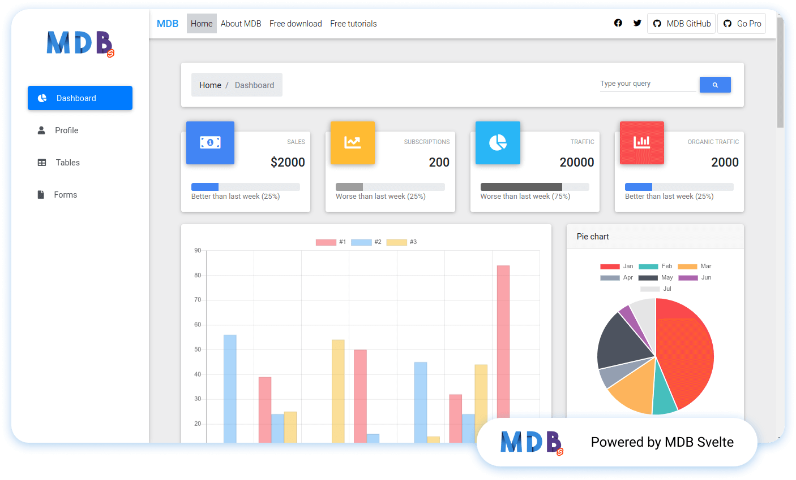

#  MDBSvelte Dashboard with SPA-Router
A dashboard made using base svelte components not sapper , contain SPA Router

A dashboard made using [mdbsvelte](https://saurav.tech/mdbsvelte)


[](https://app.fossa.com/projects/git%2Bgithub.com%2FSauravKanchan%2Fmdbsvelte-dashboard?ref=badge_shield)

### Getting Started
```shell script
npx degit SauravKanchan/mdbsvelte-dashboard my-dashboard
cd my-dashboard
npm i
npm run dev
```


## License
[](https://app.fossa.com/projects/git%2Bgithub.com%2FSauravKanchan%2Fmdbsvelte-dashboard?ref=badge_large)
